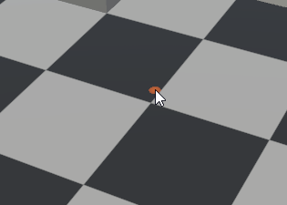

# Mouse Click Decal Shader

## Script : Scripts/ShowClickDecal.cs

This is a sample, used by the demo scene, and intended to show how to control the effect by setting shader properties from a script.  It isn't intended for real use, but feel free to modify it or use any parts you find useful.

### Properties

Property          | Description
---               | ---
Show Click        | Enables or disables completely this decal projector.
Show Duration     | How many complete cycles of the effect are shown.  May be fractional.
Speed             | How quickly the animation plays.  Negative speeds play the effect backwards.
Play Continuously | If enabled then the effect plays continuously for as long as the mouse button is pressed.  Otherwise it plays Show Duration times then stops until the button is released and pressed again.

## Shader : "Shaders/Graphs/Decal/PulsingCircleDecal"

All the shader graph does is to colour the output from the subgraph "SDF Circle Pulse" ("Shaders/SubGraphs/SDF Circle Pulse").  The subgraph contains all the code to generate the pulsing circle effect.

### Sub-Graph : "Shaders/SubGraphs/SDF Circle Pulse"

Contains all the code for generating the pulsing circle effect.  

### Material : "Materials/Mouse Click Decal"

This material exists as a baseline with sensible defaults.

#### Material (Shader) Properties

Property          | Description
---               | ---
Colour            | The pulse colour.
Pulse Width       | [0.0, 1.0] The pulse width.  Note that this essentially clamps the lower bound of the output from the sine function and thus is not linear.
Flatness          | [0.0, 1.0] How much to flatten the sine wave.  0.0 = no flattening, larger values flatten it more.
Radial Fade       | How quickly the effect fades from the centre. 0.0 = no fade; < 1.0 = fade slower; >= 1.0 = fade faster.
Number of Circles | How many circles to draw.
Centre Spot Size  | [0.0, 1.0] Size of the centre spot.  0.0 disables.
Centre Spot Fade  | [0.0, 1.0] Time over which the centre spot fades at the end of one cycle of the effect.
Time Offset       | Controls the effect's animation.  Normally this is just the elapsed time since the effect was triggered.  Decreasing values cause the effect to be reversed with the circle pulsing inwards instead of outwards.
